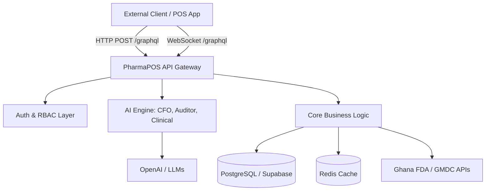

# PharmaPOS Pro — Developer API Reference

Welcome to the **PharmaPOS Pro API**. We are redefining pharmaceutical retail infrastructure by combining a lightning-fast GraphQL core with native AI capabilities, including a Virtual CFO, Internal Auditor, and clinical intelligence.

This document serves as the primary integration guide for external developers, partners, and integrators.

---

## 🏗 Architecture Overview

PharmaPOS Pro is built on a modern, code-first **GraphQL** architecture. We expose a single, unified graph for all business operations, ensuring clients only fetch exactly the data they need.



### Key Principles
1. **GraphQL First**: All business logic (POS, Inventory, Accounting, Staff, Rx) is exposed via `POST /graphql`.
2. **Real-time Subscriptions**: Live updates (e.g., new prescriptions, stock alerts) use the `graphql-ws` protocol over WebSockets.
3. **Strict RBAC**: Every operation is protected by Role-Based Access Control (RBAC) and branch-level isolation.
4. **AI-Native**: Endpoints don't just return data; they return intelligence (e.g., `getCfoBriefing`, `getInternalAuditReport`).

---

## 🌐 API Surfaces

| Surface | Base path | Purpose |
|--------|-----------|---------|
| **GraphQL** | `POST /graphql` | All business operations (Auth, POS, Rx, Inventory, Accounting, Staff, AI) |
| **GraphQL WS** | `ws://host/graphql` (or `wss://`) | Real-time Subscriptions (`graphql-ws` protocol) |
| **REST** | `GET /health/*` | Infra health probes only (used by Kubernetes/AWS) |

> **Developer Tools:** In development environments, you can access the interactive **GraphQL Playground** at `GET /graphql` and the **Swagger UI** (for REST health probes) at `GET /api-docs`.

---

## 🔐 Authentication & Transport

### Request Format
All GraphQL requests must be sent as `POST` requests with a JSON body.

- **URL:** `/graphql`
- **Headers:**
  - `Content-Type: application/json`
  - `Authorization: Bearer <access_token>`

### Body Shape
```json
{
  "query": "query { ... }",
  "variables": { "key": "value" },
  "operationName": "OptionalName"
}
```

### Obtaining a Token (Login)
To authenticate, use the `login` mutation. This is one of the few endpoints that does not require an `Authorization` header.

**Request:**
```graphql
mutation Login($email: String!, $password: String!) {
  login(input: { email: $email, password: $password }) {
    access_token
    refresh_token
    expires_in
    user {
      id
      name
      role
      branch_id
    }
  }
}
```

**Response:**
```json
{
  "data": {
    "login": {
      "access_token": "eyJhbGciOiJIUzI1NiIsInR...",
      "refresh_token": "def456...",
      "expires_in": 900,
      "user": {
        "id": "uuid",
        "name": "Azzay Owner",
        "role": "owner",
        "branch_id": "uuid"
      }
    }
  }
}
```

---

## 🧠 AI & Intelligence Endpoints

PharmaPOS Pro is the first POS to include built-in AI agents. These are accessible via standard GraphQL queries.

### 1. Virtual CFO (`getCfoBriefing`)
Analyzes the branch ledger, calculates runway, detects revenue signals, and provides actionable investment ideas.

```graphql
query GetCfoBriefing {
  cfoBriefing {
    executiveSummary
    overallHealthScore
    healthScoreNumeric
    monthRevenueFormatted
    monthNetProfitFormatted
    workingCapital {
      healthStatus
      narrative
    }
    investmentIntelligence {
      qualifiesForInvestment
      recommendations {
        title
        rationale
        estimatedRoi12MonthPct
      }
    }
  }
}
```

### 2. Internal Auditor (`getInternalAuditReport`)
Scans the database for compliance violations, financial anomalies, and staff behavior risks.

```graphql
query GetInternalAuditReport($periodStart: String!, $periodEnd: String!) {
  internalAuditReport(input: { periodStart: $periodStart, periodEnd: $periodEnd }) {
    overallRiskScore
    executiveSummary
    dispensingCompliance {
      pomViolationsCount
      gmdcValidationGapsCount
    }
    financialIntegrity {
      suspiciousRefundsCount
    }
  }
}
```

### 3. Clinical Intelligence
Drug interaction checking is performed automatically during prescription verification and sale creation. The system checks for interactions between prescribed medications and blocks contraindicated combinations at the API level.

---

## 🛒 Core Business Operations

### Point of Sale (POS)
Record a sale with offline-first idempotency.

```graphql
mutation CreateSale($input: CreateSaleInput!) {
  createSale(input: $input) {
    id
    totalAmountFormatted
    status
    items {
      productName
      quantity
      unitPriceFormatted
    }
  }
}
```

### Inventory Management
Track stock levels, expiry dates, and reorder alerts.

```graphql
query GetInventory($branchId: String!) {
  inventory(branchId: $branchId) {
    productId
    productName
    quantityOnHand
    reorderLevel
    status # e.g., "Critical", "Low", "In stock"
    batches {
      batchNumber
      expiryDate
    }
  }
}
```

---

## 📡 WebSockets (Real-time Subscriptions)

To listen for live events (e.g., a new prescription arriving from a doctor), connect via WebSockets using the `graphql-ws` protocol.

- **URL:** `wss://api.pharmapos.com/graphql`
- **Auth:** Send the JWT in the `connectionParams` during the initial handshake:
  ```json
  {
    "Authorization": "Bearer <access_token>"
  }
  ```

---

## 🚨 Error Handling

PharmaPOS Pro uses standard GraphQL error formatting, enriched with custom extension codes for programmatic handling.

```json
{
  "errors": [
    {
      "message": "Prescriber licence is invalid or expired",
      "extensions": {
        "code": "GMDC_INVALID_LICENCE",
        "statusCode": 400
      }
    }
  ],
  "data": null
}
```

**Common Error Codes:**
- `UNAUTHENTICATED`: Missing or invalid JWT.
- `FORBIDDEN`: User lacks the required RBAC role.
- `FDA_POM_VIOLATION`: Attempted to sell a Prescription-Only Medicine without a verified Rx.
- `GMDC_INVALID_LICENCE`: The doctor's licence failed validation against the Ghana Medical and Dental Council.
- `FDA_DRUG_CONTRAINDICATED`: Severe drug interaction detected; sale blocked.

---

## 🏥 Compliance & Regulatory

PharmaPOS Pro enforces strict regulatory compliance at the API level. External clients **cannot** bypass these rules:
- **POM Enforcement:** Prescription-Only Medicines cannot be checked out without a linked, verified `prescription_id`.
- **Chemical Shop Isolation:** Branches designated as "chemical shops" are hard-blocked from accessing or selling POMs.
- **Audit Logging:** Every critical action (Rx verification, price changes, refunds) is written to an immutable, append-only PostgreSQL audit log.

---

## 🛠 Next Steps for Developers

1. **Explore the Schema:** Download the full `schema.gql` or use the GraphQL Playground to explore types, inputs, and documentation strings.
2. **Authentication:** Implement the `login` mutation and ensure your client attaches the `Authorization` header to all subsequent requests.
3. **Offline Support:** If building a POS client, ensure you generate UUIDs client-side and use the `idempotencyKey` field on mutations to safely sync offline transactions when connectivity is restored.